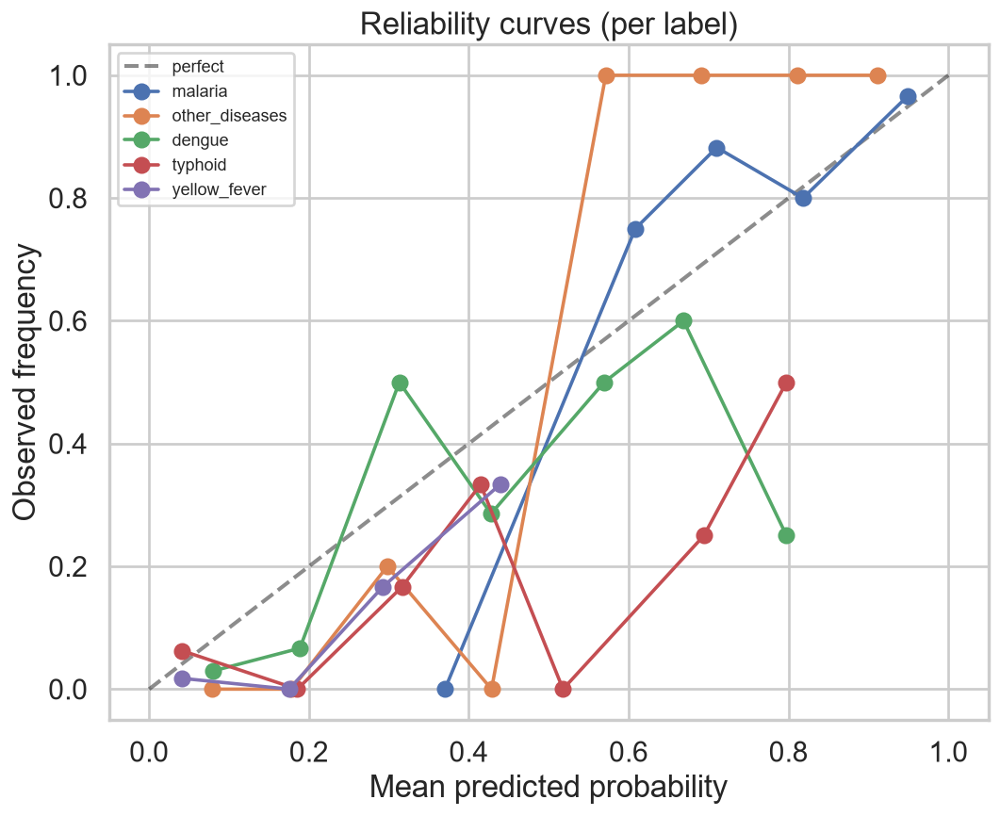

# Calibration Summary

*Trustworthy probabilities*

_Generated: 2026-06-13 13:56 — VECTRA-X pipeline_

| label | base_rate | brier | ece | mean_pred | variant |
| --- | --- | --- | --- | --- | --- |
| malaria | 0.8701 | 0.1097 | 0.0826 | 0.8287 | uncalibrated |
| other_diseases | 0.3247 | 0.0480 | 0.1599 | 0.3460 | uncalibrated |
| dengue | 0.1818 | 0.1316 | 0.1252 | 0.2709 | uncalibrated |
| typhoid | 0.0909 | 0.1063 | 0.1279 | 0.1701 | uncalibrated |
| yellow_fever | 0.0390 | 0.0371 | 0.0586 | 0.0956 | uncalibrated |
| malaria | 0.8701 | 0.1035 | 0.0446 | 0.9147 | calibrated |
| other_diseases | 0.3247 | 0.0198 | 0.0265 | 0.3323 | calibrated |
| dengue | 0.1818 | 0.1246 | 0.0499 | 0.1658 | calibrated |
| typhoid | 0.0909 | 0.0788 | 0.0587 | 0.0818 | calibrated |
| yellow_fever | 0.0390 | 0.0361 | 0.0024 | 0.0366 | calibrated |

Mean uncalibrated Brier (pre-lab, test) = 0.0865.

*Reliability curves*
