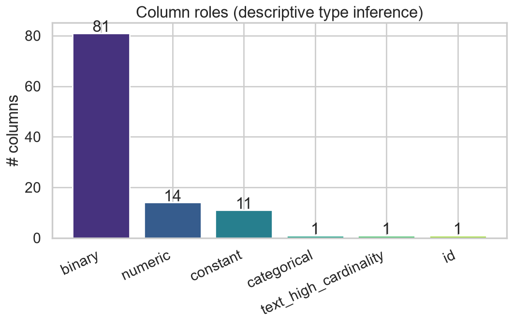
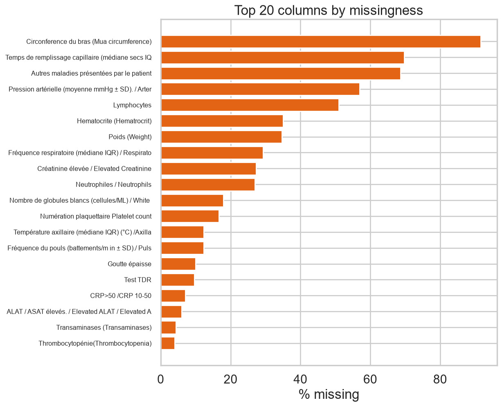
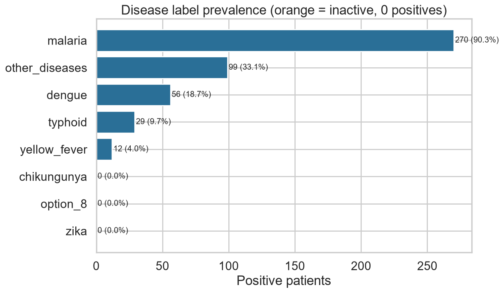
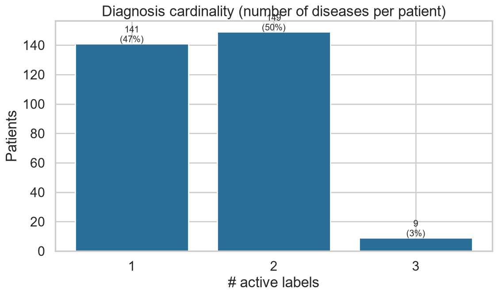

# Data Audit Summary

*VECTRA-X — official dataset*

_Generated: 2026-06-14 20:04 — VECTRA-X pipeline_

**Shape:** 300 rows × 109 columns. **Duplicate rows:** 0. **Constant columns:** 11.

## Column roles

| role | n |
| --- | --- |
| binary | 81 |
| numeric | 14 |
| constant | 11 |
| categorical | 1 |
| text_high_cardinality | 1 |
| id | 1 |

## Top missing columns

| column | n_missing | missing_pct | role |
| --- | --- | --- | --- |
| Circonference du bras (Mua circumference) | 275 | 91.6700 | numeric |
| Temps de remplissage capillaire (médiane secs IQR). / Capillary refill time (median secs IQR) | 209 | 69.6700 | numeric |
| Autres maladies présentées par le patient | 206 | 68.6700 | text_high_cardinality |
| Pression artérielle (moyenne mmHg ± SD). / Arterial blood pressure (mean mmHg ± SD) | 171 | 57.0000 | numeric |
| Lymphocytes | 153 | 51.0000 | numeric |
| Hematocrite (Hematrocrit) | 105 | 35.0000 | numeric |
| Poids (Weight) | 104 | 34.6700 | numeric |
| Fréquence respiratoire (médiane IQR) / Respiratory rate (median breaths/min IQR) | 88 | 29.3300 | numeric |
| Créatinine élevée / Elevated Creatinine | 82 | 27.3300 | numeric |
| Neutrophiles / Neutrophils | 81 | 27.0000 | numeric |
| Nombre de globules blancs (cellules/ML) / White blood cell count / WBC count (cells/ML) | 54 | 18.0000 | numeric |
| Numération plaquettaire Platelet count | 50 | 16.6700 | numeric |
| Température axillaire (médiane IQR) (°C) /Axillary temperature (median IQR) (°C) | 37 | 12.3300 | numeric |
| Fréquence du pouls (battements/m in ± SD)./ Pulse rate (mean beats/min ± SD) - Shock ou Myocarditis | 37 | 12.3300 | numeric |
| Goutte épaisse | 30 | 10.0000 | binary |

## Constant columns (dropped from modelling, logged)

- Inflammation de conjonctivite
- Rougeur faciale (Facial flushing)
- Sudation excessive (Profuse sweating)
- Maladie rhumatismale
- Maladie auto immune
- Allergies
- Cancer
- Carences en leucocytes (Leucopenia)
- Maladies diagnostiquées/Chikunguya
- Maladies diagnostiquées/Zika
- Maladies diagnostiquées/Option 8

*Column roles*

*Top missingness*

## Target structure

| label | positives | prevalence_pct | status |
| --- | --- | --- | --- |
| malaria | 270 | 90.3000 | active |
| other_diseases | 99 | 33.1100 | active |
| dengue | 56 | 18.7300 | active |
| typhoid | 29 | 9.7000 | active |
| yellow_fever | 12 | 4.0100 | active |
| chikungunya | 0 | 0.0000 | inactive |
| zika | 0 | 0.0000 | inactive |
| option_8 | 0 | 0.0000 | inactive |

Multi-label patients (>1 diagnosis): **158**; patients with no active label: **0**.

Binary-vs-free-text label agreement = 100% on all labels (encoding validated).

