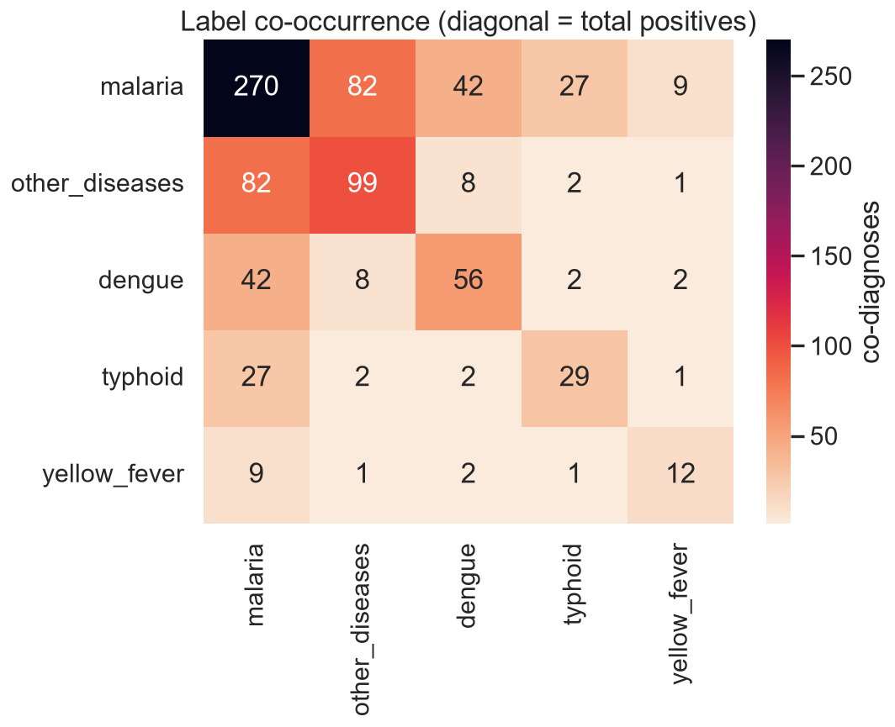
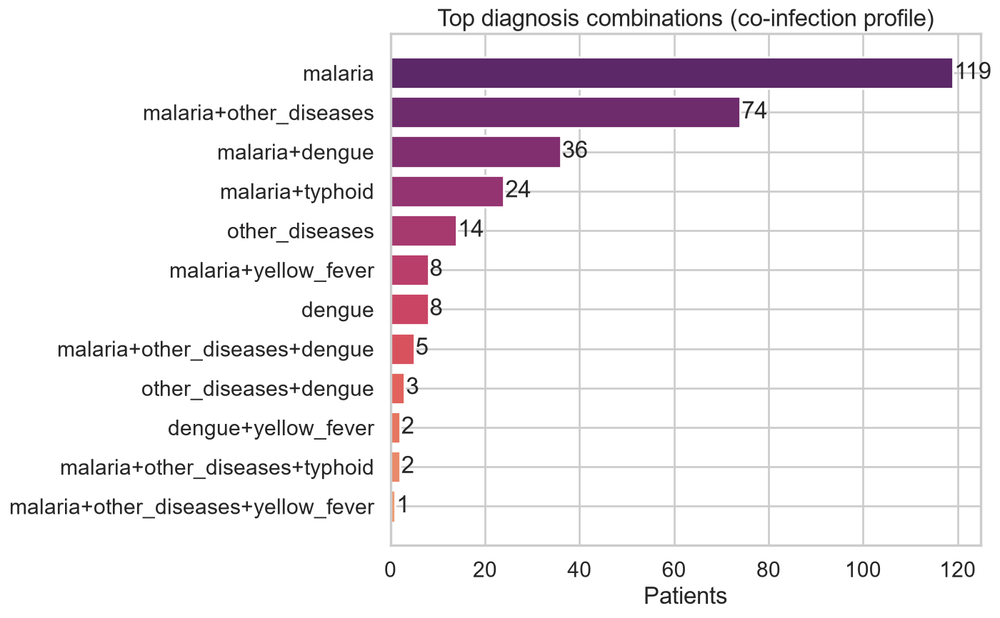
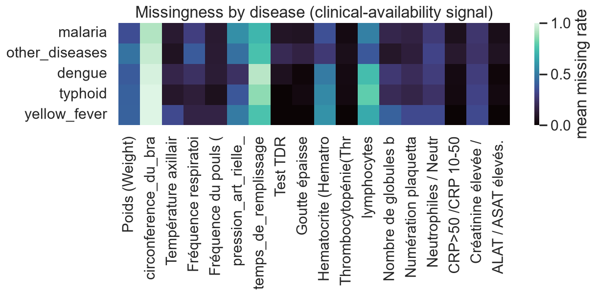
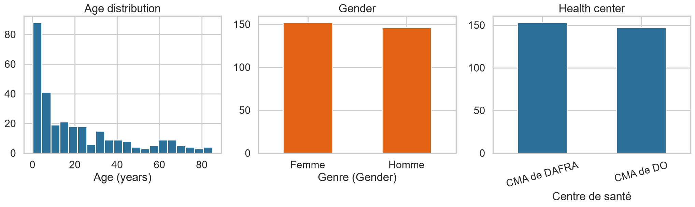
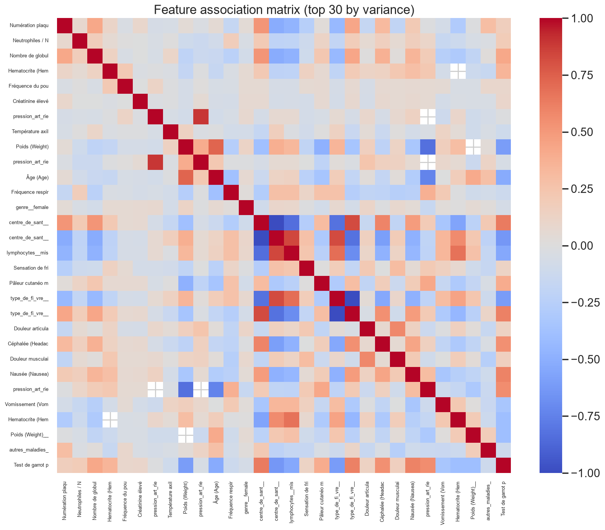
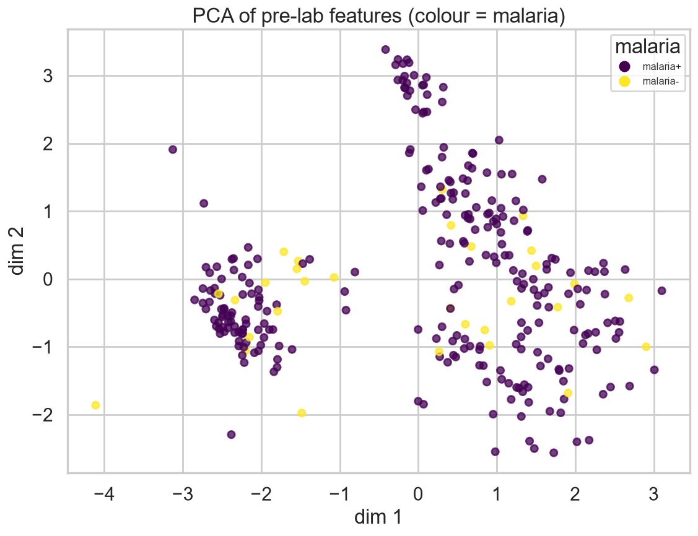

# EDA Insights

*Multi-label clinical structure*

_Generated: 2026-06-13 13:56 — VECTRA-X pipeline_

- Malaria dominates (90% prevalence) — accuracy/micro metrics are misleading; macro-F1 and per-label recall are primary.
- 158 patients carry >1 diagnosis — multi-label, not multi-class.
- Top co-diagnoses: malaria+other, malaria+dengue, malaria+typhoid (see co-infection profile).
- Several lab/vital fields are heavily missing — kept with missing-indicator flags (workflow signal).
- Two health centers enable a domain-shift / fairness axis (leave-one-center-out).

*Co-occurrence*

*Top combinations*

*Missingness by disease*

*Demographics*

*Feature associations*

*PCA projection*
