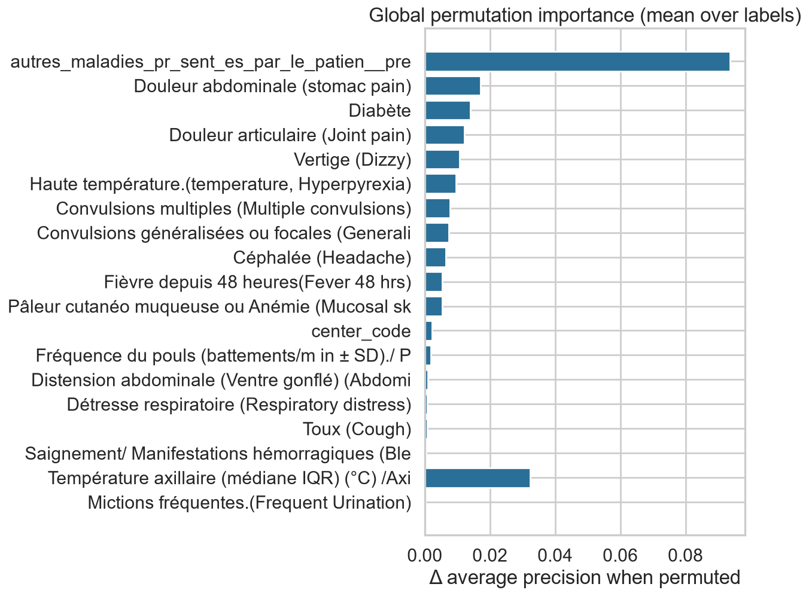
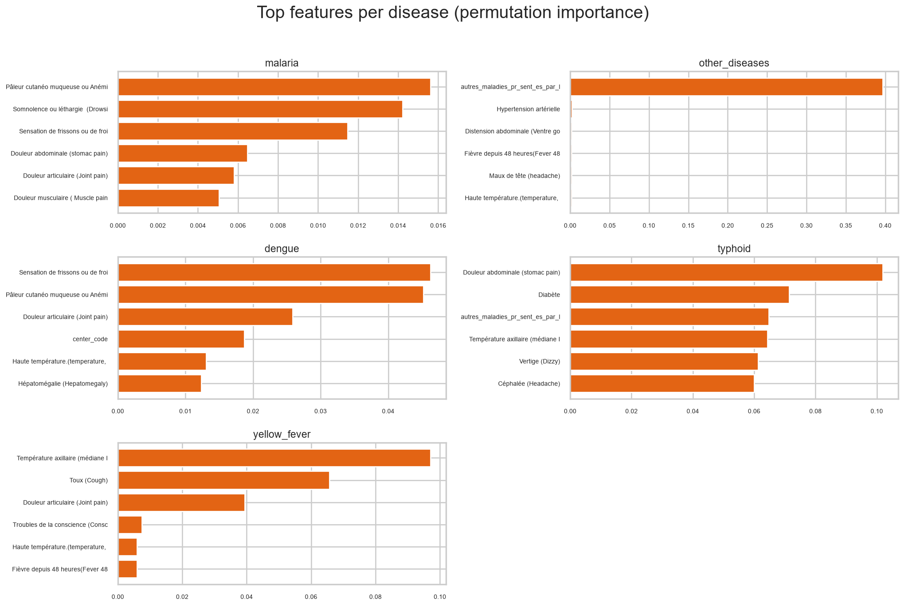
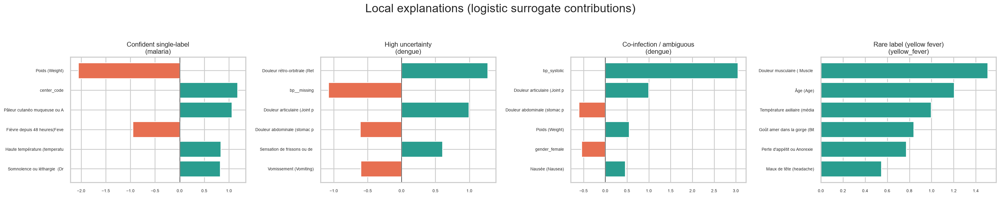

# Explainability Summary

*Permutation importance + linear local*

_Generated: 2026-06-13 12:31 — VECTRA-X pipeline_

Features are anonymised/encoded clinical **signals** — explanations describe model behaviour, not medical causation.

## Global importance (top 15)

| feature | importance_mean |
| --- | --- |
| autres_maladies_pr_sent_es_par_le_patien__present | 0.0936 |
| Température axillaire (médiane IQR) (°C) /Axillary temperature (median IQR) (°C)__missing | 0.0323 |
| Douleur abdominale (stomac pain) | 0.0171 |
| Diabète | 0.0139 |
| Douleur articulaire (Joint pain) | 0.0122 |
| Vertige (Dizzy) | 0.0106 |
| Haute température.(temperature, Hyperpyrexia) | 0.0095 |
| Convulsions multiples (Multiple convulsions) | 0.0077 |
| Convulsions généralisées ou focales (Generalised or focal convulsion) | 0.0074 |
| Céphalée (Headache) | 0.0065 |
| Fièvre depuis 48 heures(Fever 48 hrs) | 0.0054 |
| Pâleur cutanéo muqueuse ou Anémie (Mucosal skin pallor or Anemia) | 0.0054 |
| center_code | 0.0023 |
| Fréquence du pouls (battements/m in ± SD)./ Pulse rate (mean beats/min ± SD) - Shock ou Myocarditis__missing | 0.0019 |
| Distension abdominale (Ventre gonflé) (Abdominal Distension (Swelling Stomach)/ Ascites) | 0.0009 |

*Global importance*

*Per-label importance*

*Local case studies*

*SHAP summary (malaria)*
