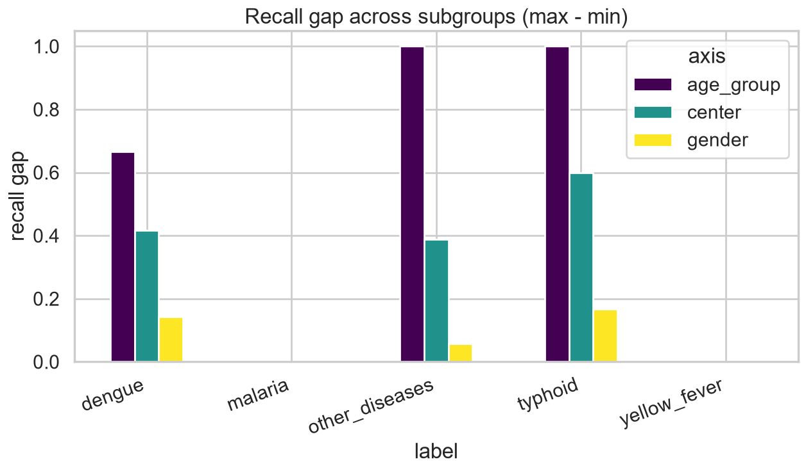

# Fairness & Robustness Summary

*Subgroup + center shift*

_Generated: 2026-06-13 12:31 — VECTRA-X pipeline_

Audited axes: health center, gender, age group. Goal: no systematic under-detection for any subgroup.

## Recall gaps (max − min across subgroup levels)

| axis | label | max_recall | min_recall | recall_gap | worst_level |
| --- | --- | --- | --- | --- | --- |
| gender | malaria | 1.0000 | 1.0000 | 0.0000 | Homme |
| gender | other_diseases | 1.0000 | 1.0000 | 0.0000 | Homme |
| gender | dengue | 0.8000 | 0.6667 | 0.1333 | Homme |
| gender | typhoid | 0.5000 | 0.0000 | 0.5000 | Femme |
| gender | yellow_fever | 1.0000 | 0.5000 | 0.5000 | Femme |
| center | malaria | 1.0000 | 1.0000 | 0.0000 | CMA de DO |
| center | other_diseases | 1.0000 | 0.9474 | 0.0526 | CMA de DAFRA |
| center | dengue | 0.7500 | 0.5000 | 0.2500 | CMA de DAFRA |
| center | typhoid | 0.5000 | 0.0000 | 0.5000 | CMA de DAFRA |
| center | yellow_fever | 1.0000 | 0.0000 | 1.0000 | CMA de DAFRA |
| age_group | malaria | 1.0000 | 1.0000 | 0.0000 | child_6_12 |
| age_group | other_diseases | 1.0000 | 0.6667 | 0.3333 | adolescent_13_18 |
| age_group | dengue | 1.0000 | 0.0000 | 1.0000 | adolescent_13_18 |
| age_group | typhoid | 1.0000 | 0.0000 | 1.0000 | child_6_12 |
| age_group | yellow_fever | 1.0000 | 0.5000 | 0.5000 | child_6_12 |

*Recall gaps*

## Leave-one-center-out stress test

Macro-F1 when transferring across centers: [0.3782, 0.3721].
