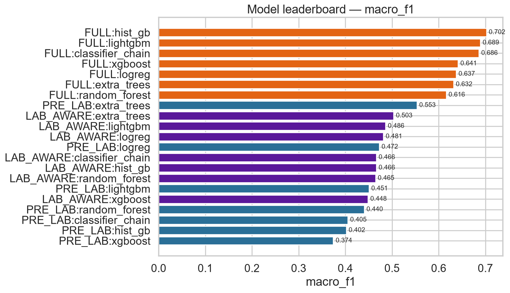
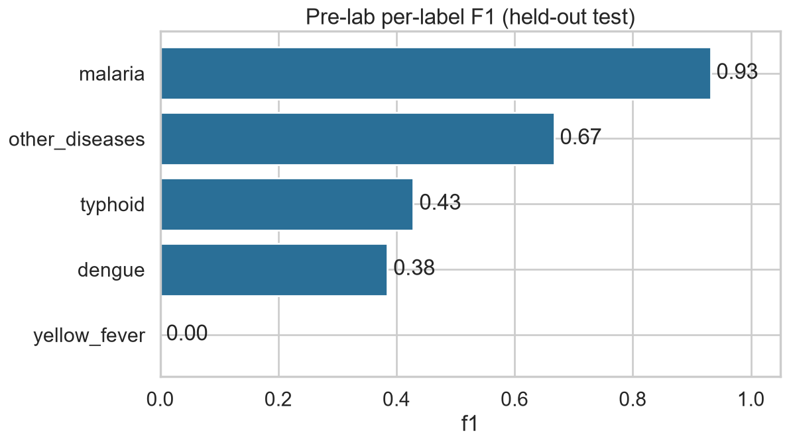
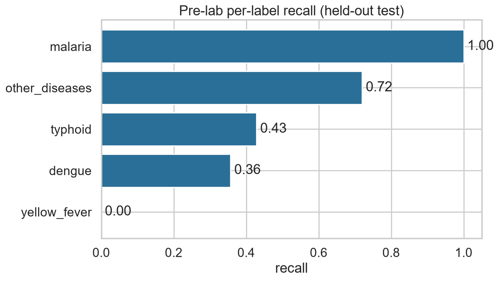
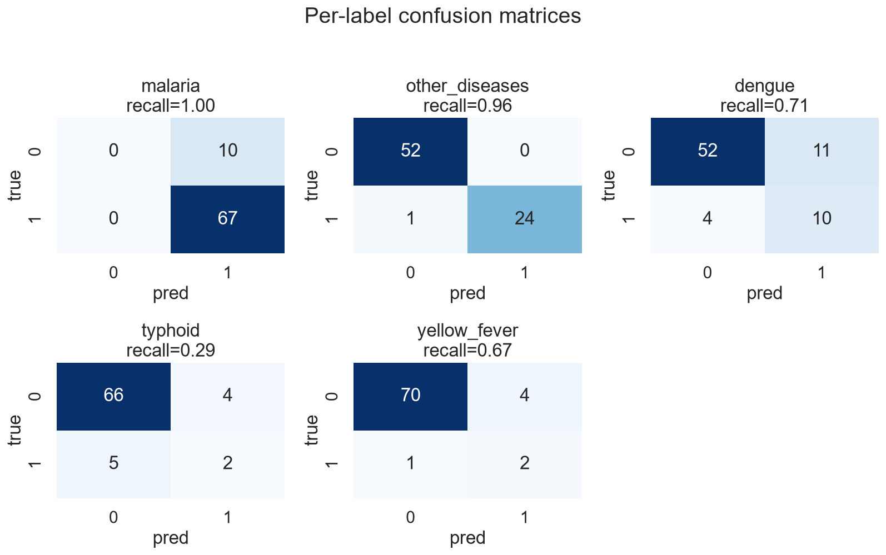
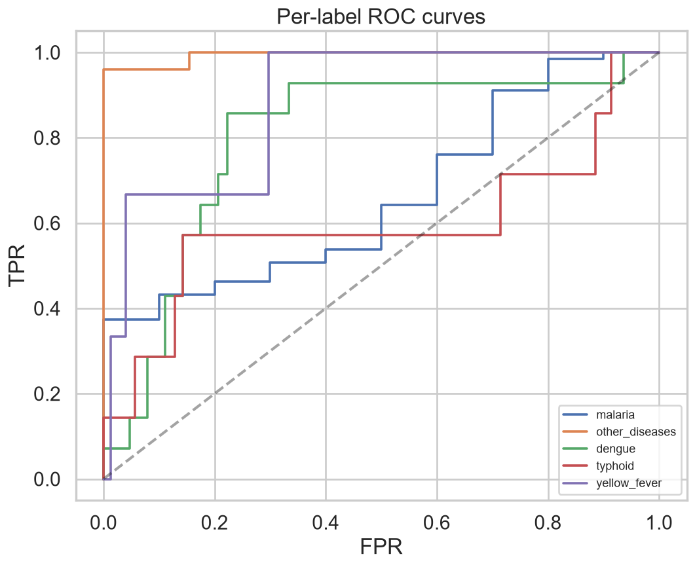
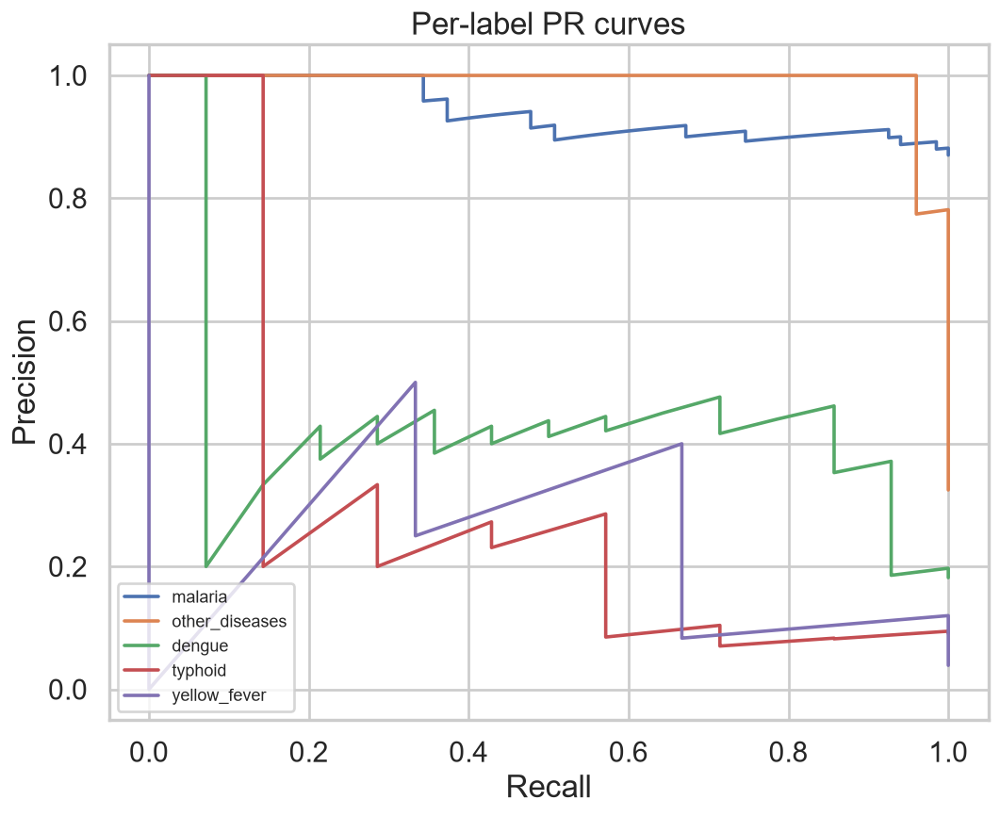

# Modeling Summary

*Leaderboard & pre-lab vs lab-aware*

_Generated: 2026-06-13 12:31 — VECTRA-X pipeline_

Best model per track (by OOF macro-PR-AUC): **{'PRE_LAB': 'extra_trees', 'LAB_AWARE': 'xgboost', 'FULL': 'hist_gb'}**.

## Leaderboard (5-fold OOF on train)

| model_track | macro_f1 | micro_f1 | macro_pr_auc | macro_roc_auc | hamming_loss | subset_accuracy |
| --- | --- | --- | --- | --- | --- | --- |
| FULL:classifier_chain | 0.6765 | 0.9296 | 0.7184 | 0.8893 | 0.0430 | 0.8072 |
| FULL:hist_gb | 0.6670 | 0.9280 | 0.7095 | 0.8883 | 0.0439 | 0.8027 |
| FULL:lightgbm | 0.6795 | 0.9101 | 0.7067 | 0.8861 | 0.0565 | 0.7489 |
| FULL:random_forest | 0.6294 | 0.9102 | 0.7058 | 0.8860 | 0.0547 | 0.7534 |
| FULL:xgboost | 0.6384 | 0.9274 | 0.7041 | 0.9060 | 0.0439 | 0.7892 |
| FULL:extra_trees | 0.6560 | 0.9054 | 0.7012 | 0.8799 | 0.0592 | 0.7578 |
| FULL:logreg | 0.6526 | 0.8454 | 0.6471 | 0.8416 | 0.1013 | 0.5919 |
| LAB_AWARE:classifier_chain | 0.5383 | 0.8627 | 0.5722 | 0.8307 | 0.0825 | 0.6771 |
| LAB_AWARE:xgboost | 0.4924 | 0.8597 | 0.5719 | 0.8515 | 0.0834 | 0.6413 |
| LAB_AWARE:hist_gb | 0.5126 | 0.8576 | 0.5690 | 0.8232 | 0.0852 | 0.6637 |
| LAB_AWARE:extra_trees | 0.5700 | 0.8551 | 0.5623 | 0.8262 | 0.0915 | 0.6502 |
| LAB_AWARE:random_forest | 0.4881 | 0.8529 | 0.5564 | 0.8369 | 0.0888 | 0.6413 |
| LAB_AWARE:lightgbm | 0.5457 | 0.8432 | 0.5549 | 0.8284 | 0.0978 | 0.6233 |
| LAB_AWARE:logreg | 0.5453 | 0.7768 | 0.5474 | 0.7941 | 0.1516 | 0.4753 |
| PRE_LAB:extra_trees | 0.5703 | 0.8354 | 0.5547 | 0.7749 | 0.1067 | 0.6009 |
| PRE_LAB:xgboost | 0.4816 | 0.8398 | 0.5383 | 0.7651 | 0.0969 | 0.6054 |
| PRE_LAB:lightgbm | 0.4915 | 0.7824 | 0.5372 | 0.7558 | 0.1372 | 0.4888 |
| PRE_LAB:classifier_chain | 0.4944 | 0.8343 | 0.5360 | 0.7470 | 0.1004 | 0.6143 |
| PRE_LAB:random_forest | 0.4977 | 0.8426 | 0.5336 | 0.7781 | 0.0969 | 0.6278 |
| PRE_LAB:hist_gb | 0.4754 | 0.8368 | 0.5295 | 0.7404 | 0.0987 | 0.6009 |
| PRE_LAB:logreg | 0.5194 | 0.7237 | 0.5257 | 0.7308 | 0.1883 | 0.3946 |

## Held-out TEST metrics by track

| track | macro_f1 | micro_f1 | macro_pr_auc | macro_recall | hamming_loss | subset_accuracy |
| --- | --- | --- | --- | --- | --- | --- |
| PRE_LAB | 0.6467 | 0.8400 | 0.6078 | 0.7253 | 0.1039 | 0.6234 |
| LAB_AWARE | 0.5551 | 0.8145 | 0.5678 | 0.6116 | 0.1195 | 0.5325 |
| FULL | 0.7049 | 0.8927 | 0.6818 | 0.7069 | 0.0649 | 0.7273 |

**Pre-lab vs lab-aware vs full**: lab-aware/full score higher because they include diagnostic-test signal; the pre-lab model is the realistic deployable triage model.

## Per-label metrics (held-out test)

| track | label | support_pos | precision | recall | f1 | roc_auc | pr_auc | tp | fp | fn | tn | false_negative_rate |
| --- | --- | --- | --- | --- | --- | --- | --- | --- | --- | --- | --- | --- |
| PRE_LAB | malaria | 67 | 0.8701 | 1.0000 | 0.9306 | 0.6970 | 0.9421 | 67 | 10 | 0 | 0 | 0.0000 |
| PRE_LAB | other_diseases | 25 | 1.0000 | 0.9600 | 0.9796 | 0.9946 | 0.9913 | 24 | 0 | 1 | 52 | 0.0400 |
| PRE_LAB | dengue | 14 | 0.4762 | 0.7143 | 0.5714 | 0.8016 | 0.4548 | 10 | 11 | 4 | 52 | 0.2857 |
| PRE_LAB | typhoid | 7 | 0.3333 | 0.2857 | 0.3077 | 0.5959 | 0.3106 | 2 | 4 | 5 | 66 | 0.7143 |
| PRE_LAB | yellow_fever | 3 | 0.3333 | 0.6667 | 0.4444 | 0.8829 | 0.3400 | 2 | 4 | 1 | 70 | 0.3333 |
| LAB_AWARE | malaria | 67 | 0.9552 | 0.9552 | 0.9552 | 0.9403 | 0.9901 | 64 | 3 | 3 | 7 | 0.0448 |
| LAB_AWARE | other_diseases | 25 | 1.0000 | 0.9600 | 0.9796 | 0.9685 | 0.9752 | 24 | 0 | 1 | 52 | 0.0400 |
| LAB_AWARE | dengue | 14 | 0.3704 | 0.7143 | 0.4878 | 0.7812 | 0.4877 | 10 | 17 | 4 | 46 | 0.2857 |
| LAB_AWARE | typhoid | 7 | 0.3000 | 0.4286 | 0.3529 | 0.5653 | 0.2860 | 3 | 7 | 4 | 63 | 0.5714 |
| LAB_AWARE | yellow_fever | 3 | 0.0000 | 0.0000 | 0.0000 | 0.7117 | 0.1000 | 0 | 4 | 3 | 70 | 1.0000 |
| FULL | malaria | 67 | 0.9552 | 0.9552 | 0.9552 | 0.9507 | 0.9921 | 64 | 3 | 3 | 7 | 0.0448 |
| FULL | other_diseases | 25 | 1.0000 | 0.9600 | 0.9796 | 0.9838 | 0.9817 | 24 | 0 | 1 | 52 | 0.0400 |
| FULL | dengue | 14 | 1.0000 | 0.8571 | 0.9231 | 0.9977 | 0.9911 | 12 | 0 | 2 | 63 | 0.1429 |
| FULL | typhoid | 7 | 0.6000 | 0.4286 | 0.5000 | 0.6061 | 0.3620 | 3 | 2 | 4 | 68 | 0.5714 |
| FULL | yellow_fever | 3 | 0.1111 | 0.3333 | 0.1667 | 0.5631 | 0.0821 | 1 | 8 | 2 | 66 | 0.6667 |

## Co-infection detector (Track 4, cohort OOF)

| model | roc_auc | pr_auc |
| --- | --- | --- |
| extra_trees | 0.8628 | 0.8714 |
| logreg | 0.8625 | 0.8746 |
| random_forest | 0.8525 | 0.8503 |
| hist_gb | 0.8447 | 0.8657 |
| xgboost | 0.8418 | 0.8629 |
| lightgbm | 0.8407 | 0.8556 |

*Leaderboard*

*Per-label F1*

*Recall*

*Confusion*

*ROC*

*PR*
