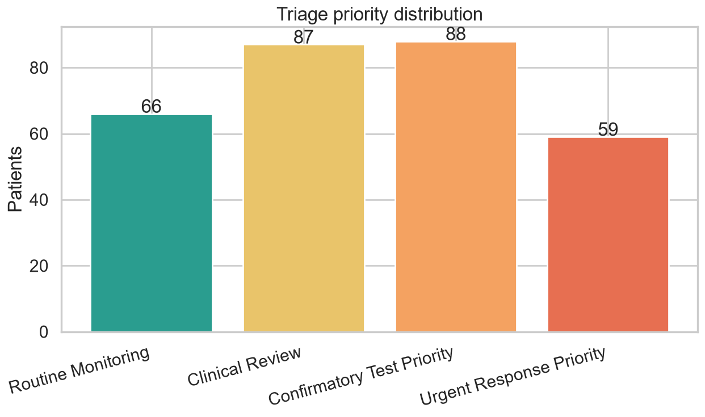
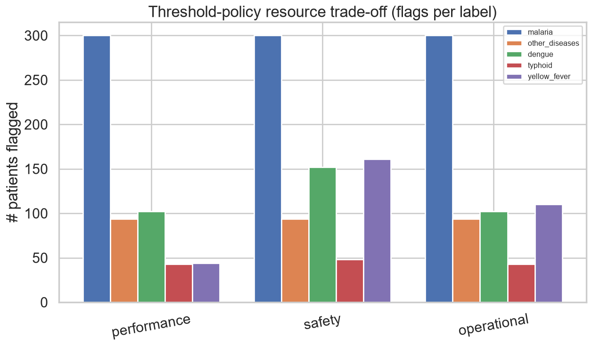

# Resource Simulation Summary

*Operational impact*

_Generated: 2026-06-13 02:43 — VECTRA-X pipeline_

| metric | count | pct |
| --- | --- | --- |
| total_patients | 300 | 100.0000 |
| predicted_malaria | 300 | 100.0000 |
| predicted_other_diseases | 94 | 31.3300 |
| predicted_dengue | 102 | 34.0000 |
| predicted_typhoid | 43 | 14.3300 |
| predicted_yellow_fever | 44 | 14.6700 |
| tier_Routine_Monitoring | 66 | 22.0000 |
| tier_Clinical_Review | 87 | 29.0000 |
| tier_Confirmatory_Test_Priority | 88 | 29.3300 |
| tier_Urgent_Response_Priority | 59 | 19.6700 |
| high_priority_patients | 147 | 49.0000 |
| require_confirmatory_test | 88 | 29.3300 |
| high_uncertainty_cases | 44 | 14.6700 |
| ambiguous_or_coinfection_cases | 271 | 90.3300 |

*Priority distribution*

*Policy trade-off*
