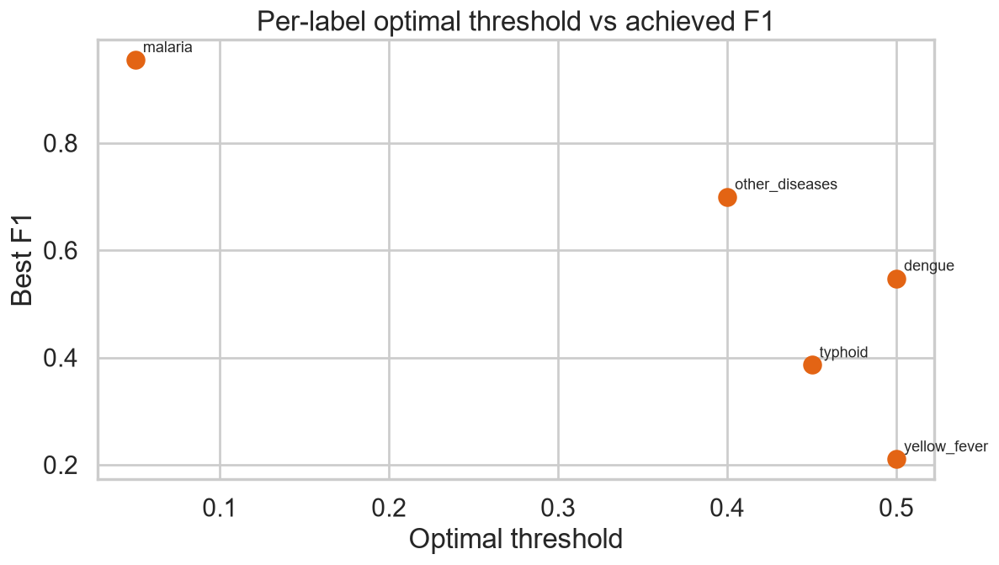

# Threshold Strategy

*Three clinical policies*

_Generated: 2026-06-14 20:04 — VECTRA-X pipeline_

Default 0.5 is rarely optimal under imbalance. Thresholds tuned per label on out-of-fold train predictions.

## Per-label optimisation

| label | thr_maxF1 | f1 | thr_recall_oriented | recall | thr_balanced |
| --- | --- | --- | --- | --- | --- |
| malaria | 0.0500 | 0.9551 | 0.0500 | 1.0000 | 0.0500 |
| other_diseases | 0.4000 | 0.6994 | 0.0500 | 1.0000 | 0.4000 |
| dengue | 0.5000 | 0.5476 | 0.2000 | 0.8571 | 0.5000 |
| typhoid | 0.4500 | 0.3860 | 0.4500 | 0.5000 | 0.4500 |
| yellow_fever | 0.5000 | 0.2105 | 0.0500 | 0.3333 | 0.5000 |

## Policies

| label | performance | safety | operational |
| --- | --- | --- | --- |
| malaria | 0.0500 | 0.0500 | 0.0500 |
| other_diseases | 0.4000 | 0.4000 | 0.4000 |
| dengue | 0.5000 | 0.2000 | 0.5000 |
| typhoid | 0.4500 | 0.4500 | 0.4500 |
| yellow_fever | 0.5000 | 0.0500 | 0.5000 |

- **Performance** — maximise per-label F1.
- **Safety** — lower thresholds for severe/rare labels (dengue, typhoid, yellow fever) to raise recall.
- **Operational** — balanced threshold to limit unnecessary confirmatory-test burden.

*Threshold vs F1*
