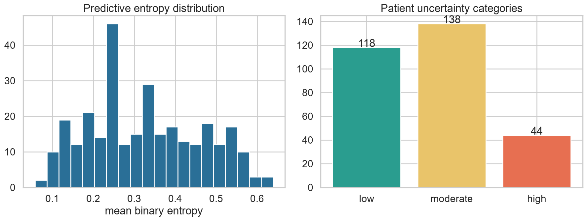

# Uncertainty Summary

*Entropy, margin, set size*

_Generated: 2026-06-13 12:31 — VECTRA-X pipeline_

Per-patient uncertainty from predictive entropy, top-2 margin, #labels above threshold, and conformal set size.

| level | patients |
| --- | --- |
| moderate | 138 |
| low | 118 |
| high | 44 |

*Uncertainty*
